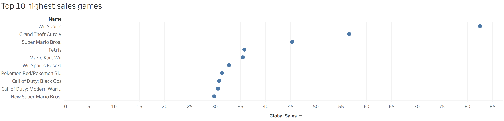
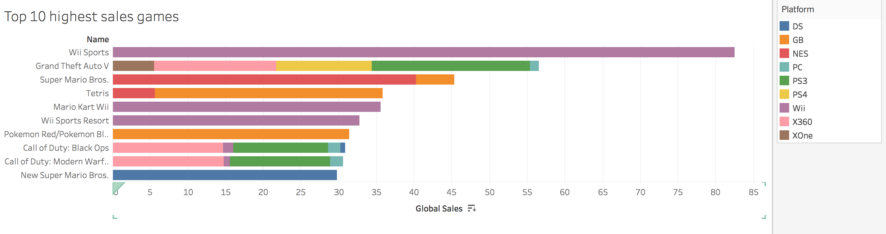
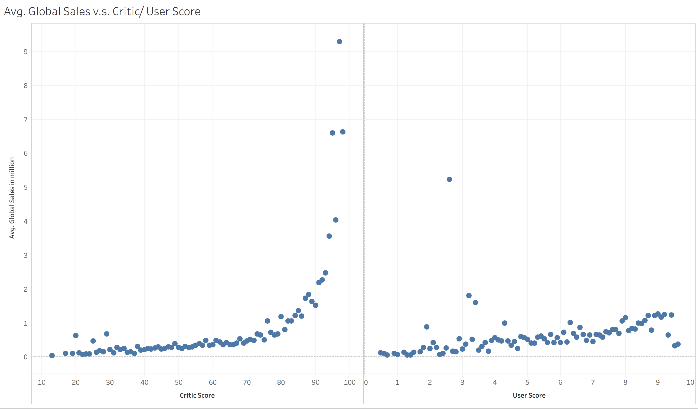
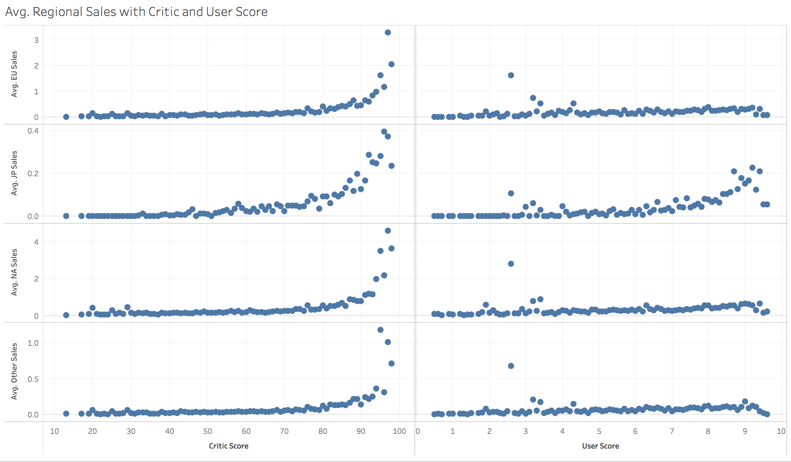
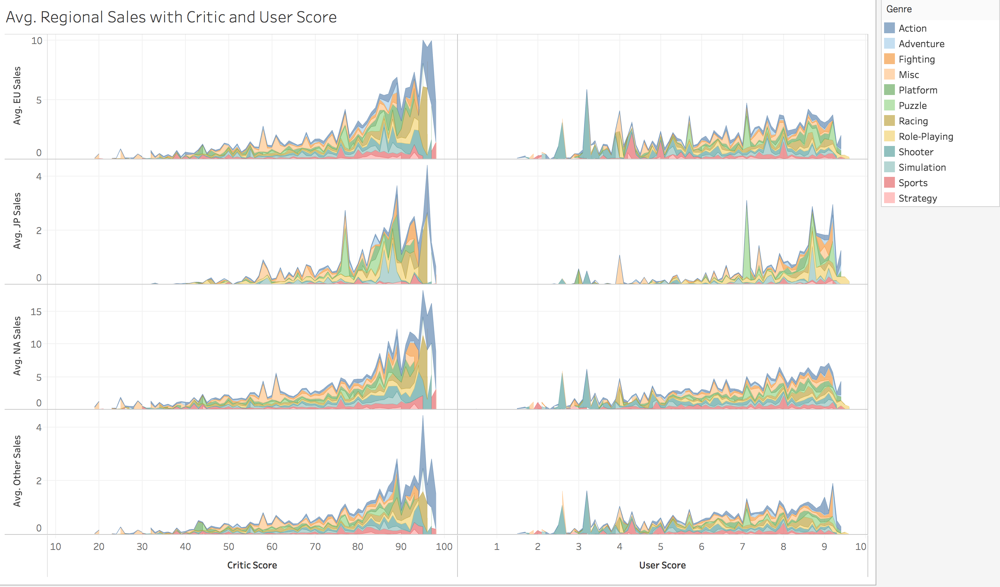
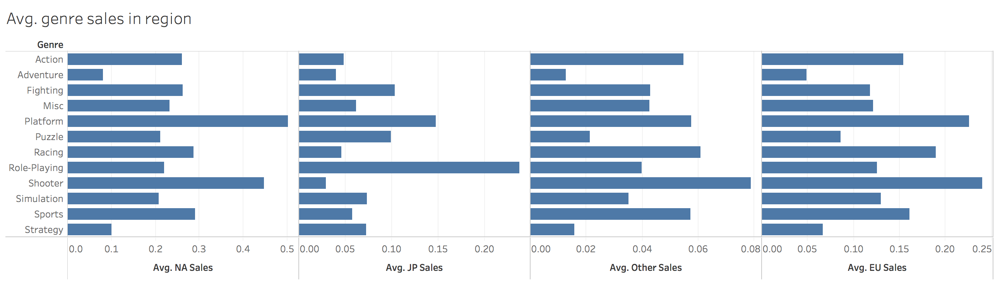

# EDA of video games sales

## About the dataset
Since I play video games a lot, I am interested in knowing how's the sale of game of my choice. I found the dataset at [kaggle.com](https://www.kaggle.com/rush4ratio/video-game-sales-with-ratings). This data set contains the game sales records and scores by gamers and Metacritic. 

## Exploratory Analysis Process

I start by examing the very simple question: **What are the highest rating games?** This is a fairly simple question. What I need to do is to put games in rows and SUM of global sales in columns, selecting the top 10 observations.

Since the dataset contains games released on 2016, some of the best sales games are not in the list. But I can still reconize most of them. Then I aksed myself "**What are the platforms they are released on?**" because modern games are usually selling on multiple platforms. So then I added platform into filter section and change the marks from dots to bars so that I can compare shares/ sales made in different platforms.
.
Some of the results matched my prediction but some really surprised me. For example, PC only took such little percent in total sales of Grand Theft Auto V.

Then I started to ask myself: "**So does the scores of the game affect the sale?**" In order to verify that, I first made another visualization: I put cirtic score and user score to columns and changed them to dimension. For rows I put global sales and changed it to average value to see the general trend.

This actually tells some interesting facts. Though the scale of critic score and user score is different: Cirtic scores are on a scale of 100 while user scores are on a scale of 10, critic scores affect the global sales exponationally while user scores are very linear. 

What about regional sales? I removed global sales from rows and replace with EU sales, JP sales, other(region sales) and NA sales. The result shows that the previous pattern works for most region except JP, where user scores tend to have exponatioal effect too. 

Okay, **how are different genres doing in the sales**? To compare the result, I assigned color endoing to genre and changed the shape encoding to area. Now the result clearly shows some "hierarchies":
 Action genre is the most popular genre for both critic and gamers among every region.

So this leads to my final question: "**What kind of games will be success at one region?**" To answer that question, I put average value of NA sales, JP sales, Other sales and EU sales to the column, and put genre on rows. I also changed the graph type to barchart for better comparision. 

Since the dataset contains incomplete cells, I removed the rows that has **NO** genre record. After the cleaning, the visualization shows interesting findings: that JP gamers have extremely high favor of role-playing game and disfavor for shooter game which is more popular in other regions. This could be explained by their animation culture. Strategy games has on average the least sales due to the high learning-curve and high time-per-round. The favor for shooter, racing, and action games shows that gamers love games that can give immediate feedback as well as sense of achievement from competition. So game developer should consider these genres more.